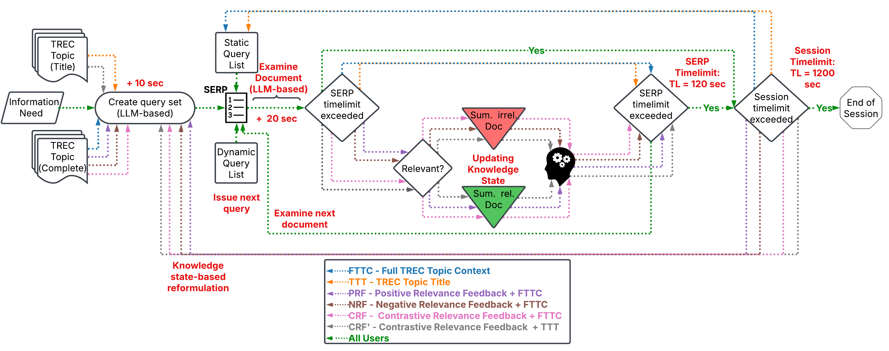

# SIGIR2025-Contrastive_Prompting

Title:

```
Evaluating Contrastive Feedback for Effective User Simulations
```


This repository is corresponding to the Short Paper with the Title "Evaluating Contrastive Feedback for Effective User Simulations" submitted for the SIGIR 2025 Short Paper Track.
The code is a slightly adapted form of the implementation of the SimIIR-3 framework. 

## Setup the Environment:

For creating the necessary environment to be able to use this Repository, you can use:

```shell

docker-compose up

```

This command needs to be executed within the Repository directory and creates a Docker Container with all required dependencies. After attaching the container you only need to start ollama to download and run the desired LLM. For the experiments LLama3.3 was used, if you would like to try another model, you have to adapt the user configurations accordingly.

## Datasets

Due to the licensing of the Core17 and Core18 datasets used, these were not included in indexed form or otherwise in the Github. Jupyter notebooks are provided within the `datasets` directory for the purpose of indexing, if you have access to the datasets. In the code, the indexed datasets are expected to be located in the following directories:
- `./datasets/indices/nyt`
- `./datasets/indices/wapo`

The original implementation of the Framework can be found . 

## Prompting Examples

Here is an example of how the LLM was prompted to generate a list of potential queries using only contrastive feedback summaries, without access to the full topic description:

```text
You are a journalist assessing the relevance of news articles for the following topic and need to generate search queries to find as much relevant material as quickly as possible.

Queries should be as diverse as possible and avoid repetition and no more than 3 query terms.
Topic Title: "AI regulation in the EU"

Summary of documents, that were judged as relevant before: "The EU Parliament passed legislation to regulate AI, focusing on transparency, accountability, and banning certain surveillance technologies."
Summary of documents, that were judged as irrelevant before: "Documents discuss general AI applications in industry and education, without mention of policy or legal frameworks."

Please use the summaries of the relevant and the irrelevant documents to refine the queries, ensuring that the documents retrieved are similar to those in the relevant document summaries, thereby helping to focus on finding more relevant documents.

Your response should be a JSON object with the following schema:
{
  "queries": ["...", "...", "..."]
}
```
In other approaches, the LLM was also provided with the topic title and full topic description. Depending on the specific use case, the prompt included either both relevance-based summaries or just one of them (e.g., only relevant or only irrelevant documents).

Here is an example of how the LLM was prompted to generate a relevance judgment for the given document contenxt using only contrastive feedback summaries, without access to the full topic description:

```text
You are a journalist assessing the relevance of news articles for the following topic.

Topic Title: "The impact of artificial intelligence on modern healthcare systems"

Summary of documents that were judged as relevant before: 
"A relevant document described how AI is being used to predict patient readmission, improve diagnostic accuracy using imaging data, and personalize treatment plans in oncology."

Summary of documents that were judged as irrelevant before: 
"An irrelevant document focused on general machine learning applications in marketing, without any reference to healthcare."

Please use the summaries of the relevant and the irrelevant documents that were found for your decision.

—BEGIN DOC CONTENT—
Document Title: "AI-driven diagnostics revolutionize radiology departments"

Document Contents: 
"The article discusses recent implementations of AI-powered imaging tools in hospital radiology departments. These tools assist in detecting abnormalities in scans, reduce diagnostic errors, and speed up the analysis process for patients with cancer or neurological conditions. Interviews with healthcare professionals indicate a significant impact on treatment timelines and accuracy."
—END DOC CONTENT—

Judge whether the document is relevant given the topic description.

{format_instructions}
```

In other approaches, the LLM was provided with the full topic description, instead of the topic title. Depending on the specific use case, the prompt included either both relevance-based summaries or just one of them (e.g., only relevant or only irrelevant documents).


Here is an example for how the LLM was prompted to create a summary of the already seen (ir)relevant documents:

```text
Below you get the content of all the relevant documents that were found separated by newlines. Please create a brief summary of the knowledge that you gained from the content.

Neural IR methods have improved.

BERT and T5 perform well in ranking tasks.

Sparse methods are efficient and interpretable.

Your response should be a JSON object with the following schema:
{
  "summary": "..."
}
```


## License

This project is licensed under the MIT License - see the LICENSE file for details.

