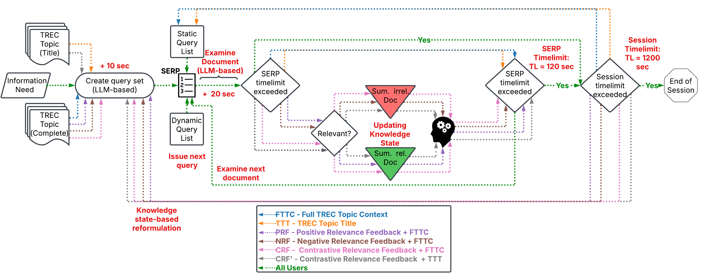

# SIGIR2025-Contrastive_Prompting

Title:

```
Evaluating Contrastive Feedback for Effective User Simulations
```


This repository is corresponding to the Short Paper with the Title "Evaluating Contrastive Feedback for Effective User Simulations" submitted for the SIGIR 2025 Short Paper Track.
The code is a slightly adapted form of the implementation of the SimIIR-3 framework. 

## Setup the Environment:

For creating the necessary environment to be able to use this Repository, you can use:

```shell

docker-compose up

```

This command needs to be executed within the Repository directory and creates a Docker Container with all required dependencies. After attaching the container you only need to start ollama to download and run the desired LLM. For the experiments LLama3.3 was used, if you would like to try another model, you have to adapt the user configurations accordingly.

## Datasets

Due to the licensing of the Core17 and Core18 datasets used, these were not included in indexed form or otherwise in the Github. Jupyter notebooks are provided within the `datasets` directory for the purpose of indexing, if you have access to the datasets. In the code, the indexed datasets are expected to be located in the following directories:
- `./datasets/indices/nyt`
- `./datasets/indices/wapo`

The original implementation of the Framework can be found . 

## License

This project is licensed under the MIT License - see the LICENSE file for details.

